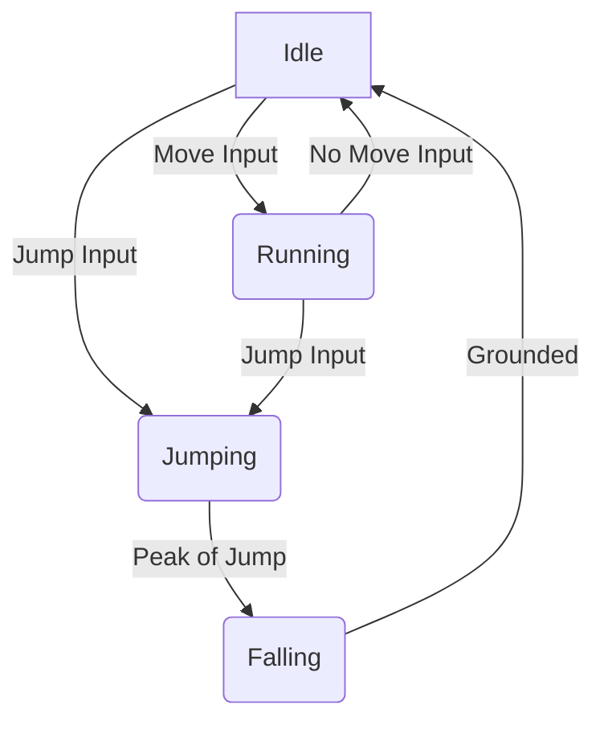

<p align="center">
  
</p>

<p align="center">
<pre>
 ____  ____  __    __
(  _ \(  _ \(  )  (  )
 )   / ) _ < )(__  )(
(__\_)(____/(____)(__)
</pre>
</p>

# 🚀 2D Platformer Adventure 🚀


Welcome to the **2D Platformer Adventure**! This is a classic-style 2D platformer game developed with the Unity engine, designed to challenge your skills and provide a fun, engaging experience. Navigate through treacherous levels, avoid deadly traps, and guide your hero to victory! This document provides a comprehensive overview of the project, from its core philosophy to its technical implementation.

---

## 📜 Story

In a world shrouded in mystery, a lone hero embarks on a perilous journey to uncover ancient secrets. The path is fraught with danger, from spike pits to moving platforms. Only the most agile and determined will survive to see the end of the quest. The narrative is intentionally kept simple to focus on the gameplay, but it provides a backdrop for the player's adventure, giving context to the challenges they face. The world is old and filled with remnants of a forgotten civilization, and the player's journey is one of discovery as much as it is of survival.

---

## 🎯 Project Philosophy

The development of this 2D platformer is guided by a few core principles:

*   **Gameplay First:** The primary focus is on creating a tight, responsive, and enjoyable gameplay experience. Every feature and design decision is made with the player's experience in mind.
*   **Challenging but Fair:** The game is designed to be difficult, but not unfair. Every obstacle and enemy is designed to be overcome with skill and practice. The game respects the player's time and effort.
*   **Nostalgic Feel:** The game aims to evoke the feeling of classic 2D platformers from the 8-bit and 16-bit eras, while incorporating modern design sensibilities and the power of the Unity engine.
*   **Open and Extensible:** The project is open-source and designed to be easily understood and modified. We encourage the community to contribute, learn from the code, and create their own experiences.

---

## 🎮 Gameplay

The core of the game is precision platforming. Players must navigate a series of levels, each with its own unique layout and set of challenges. The game is designed to be challenging but fair, with tight controls and predictable physics.

### Key Mechanics
*   **🏃‍♂️ Running and Jumping:** Master the basic movements to traverse the levels. The jump is physics-based, allowing for variable jump heights depending on how long the jump button is held.
*   **☠️ Trap Evasion:** Timing and precision are key to avoiding the various traps scattered throughout the world. Traps include spike pits, falling platforms, and projectile launchers.
*   **🗺️ Exploration:** Discover hidden paths and secrets in each level. Collectibles are hidden in hard-to-reach places, rewarding players who explore every nook and cranny.

---

## ✨ Features

*   **Responsive Player Controls:** Enjoy smooth and intuitive controls that allow for precise movement and jumping. The control system is built using Unity's Input System, making it easily configurable.
*   **Challenging Level Design:** Each level is carefully crafted to test your platforming skills with a variety of obstacles and traps. The difficulty curve is designed to gradually introduce new mechanics and challenges.
*   **Dynamic Camera System:** The camera smoothly follows the player, ensuring you always have the best view of the action. The camera system includes features like look-ahead and configurable dead zones.
*   **Parallax Backgrounds:** Beautiful, multi-layered backgrounds create a sense of depth and immersion as you travel through the game world. The parallax effect is achieved through a custom script that moves background layers at different speeds.
*   **Modular Codebase:** The project is structured with clean, commented, and modular C# scripts, making it easy to understand and extend.

---

## 🕹️ Controls

Use your keyboard to navigate the hero through the levels.

```
      (Jump)
        ___
       |   |
       |___|
  ___         ___
 | A |       | D |
 |___|       |___|
(Left)      (Right)
```
*   **A / Left Arrow:** Move Left
*   **D / Right Arrow:** Move Right
*   **Spacebar:** Jump

---

## 🔄 Animation State Machine

The character animations are controlled by a state machine that transitions between different animation states based on player input. Here is a visual representation of the animation state machine:



*   **Idle:** The default state when the player is not moving.
*   **Running:** The state when the player is moving left or right.
*   **Jumping:** The state when the player is moving upwards after a jump.
*   **Falling:** The state when the player is falling downwards.

---

## 🛠️ Getting Started

To play the game, you will need to have Unity Hub and a compatible version of the Unity Editor installed.

1.  **Clone the repository:**
    ```bash
    git clone https://github.com/ravisairockey/2D_Platformer.git
    ```
2.  **Open the project in Unity Hub:**
    *   Launch Unity Hub.
    *   Click on "Add".
    *   Navigate to the cloned repository folder and select it.
3.  **Open the project in the Unity Editor:**
    *   Select the project from the list in Unity Hub.
    *   Choose the appropriate Unity Editor version (2020.3 or later recommended).
4.  **Run the game:**
    *   Once the project is open in the Unity Editor, open the `MainScene` from the `Assets/Scenes` folder.
    *   Press the "Play" button at the top of the editor.

---

## 💻 Technical Deep Dive

This section provides a more detailed look at the technical implementation of the game.

### Architecture
The project follows a standard Unity project structure. The core logic is separated into several key managers:

*   **GameManager:** Handles the overall game state, such as pausing, resuming, and restarting the game.
*   **PlayerController:** Manages player input and movement.
*   **CameraController:** Controls the camera's behavior.
*   **LevelManager:** Responsible for loading and managing levels.

### Key Scripts
Here are some of the most important scripts in the project:

*   `PlayerMovement.cs`: This script handles all the logic for player movement, including running, jumping, and collision detection. It uses a state machine to manage the player's different states (e.g., idle, running, jumping, falling).
*   `CameraFollow.cs`: This script makes the camera follow the player. It includes smoothing and look-ahead features to create a more cinematic feel.
*   `Parallax.cs`: This script creates the parallax scrolling effect for the backgrounds. It moves the background layers at different speeds relative to the camera's movement.
*   `Trap.cs`: A base class for all traps in the game. It defines the basic behavior of a trap, such as dealing damage to the player.

### Assets
The project uses a combination of original and third-party assets. All assets are organized into folders within the `Assets` directory.

---

## 🌍 World and Level Design

The game world is designed to be a mysterious and dangerous place. The level design follows a few key principles:

*   **Flow:** Levels are designed to have a natural flow, guiding the player forward while still allowing for exploration.
*   **Pacing:** The pacing of each level is carefully controlled, with a mix of fast-paced action and slower, more methodical platforming sections.
*   **Variety:** Each level introduces new challenges and mechanics to keep the gameplay fresh and interesting.

---

## 🎨 Art and Sound

The art style of the game is a modern take on classic pixel art. The color palette is carefully chosen to create a cohesive and atmospheric look. The sound design is also a key part of the experience, with a memorable soundtrack and satisfying sound effects.

---

## 🚀 Future Development

This project is an ongoing effort, and there are many plans for future development. Here is a roadmap of some of the features we hope to add:

*   **More Levels:** We plan to add many more levels, each with its own unique theme and challenges.
*   **New Enemies:** We want to add a variety of enemies to the game, each with its own unique behavior.
*   **Boss Fights:** Epic boss fights at the end of each world are a high priority.
*   **Power-ups:** We plan to add a variety of power-ups that will give the player new abilities.
*   **Story Expansion:** We hope to expand the story with cutscenes and in-game lore.

---

## 💬 Community and Support

Join our community to discuss the game, share your creations, and get help with any issues you may be having.

*   **Discord:** [Link to your Discord server]
*   **Forums:** [Link to your forums]
*   **Issue Tracker:** If you find a bug, please report it on our [GitHub Issue Tracker](https://github.com/ravisairockey/2D_Platformer/issues).

---

## ❓ FAQ

**Q: What version of Unity should I use?**
A: The project is developed with Unity 2020.3. We recommend using this version or a later one.

**Q: Can I contribute to the project?**
A: Yes! We welcome contributions from the community. Please see the "Contributing" section for more details.

**Q: Where can I find the latest version of the game?**
A: The latest version of the game can always be found on the [GitHub Releases](https://github.com/ravisairockey/2D_Platformer/releases) page.

---

## 🤝 Contributing

Contributions are welcome! If you have any ideas, suggestions, or bug fixes, please feel free to open an issue or submit a pull request. Before contributing, please read our [Code of Conduct](CODE_OF_CONDUCT.md).

---

## ⚖️ Disclaimer & License

This project is the intellectual property of Ravi Sai Vigneswara.

This project is licensed under the **GNU General Public License v3.0**. You are free to use, modify, and distribute this software. However, you must document any changes you make and adhere to the terms of the GPLv3 license. Please see the `LICENSE` file for more details.

---

## 🙏 Acknowledgements

A big thank you to all the people who have contributed to this project and to the open-source community for providing the tools and resources that made this game possible.
